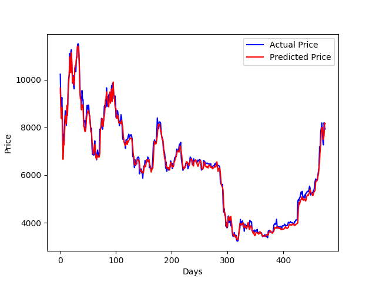

# Price Prediction using Deep Learning


## Introduction
This repository uses recurrent neural networks to predict the price of any stock, currency or cryptocurrency ( any market that [yahoo_fin](http://theautomatic.net/yahoo_fin-documentation/) library supports ) using **keras** library.

## Getting Started
to use this repository, install required packages
1. Python 3.6
2. keras==2.2.4
3. sklearn==0.20.2
4. numpy==1.16.2
5. pandas==0.23.4
6. matplotlib==2.2.3
7. yahoo_fin

using the following command:
```
pip3 install -r requirements.txt
```
## Dataset
Dataset is downloaded automatically using [yahoo_fin](http://theautomatic.net/yahoo_fin-documentation/) package and stored in `data` folder. click [here](http://theautomatic.net/yahoo_fin-documentation/) for more information about different tickers.
### **Example**
```python
from keras.layers import GRU, LSTM, CuDNNLSTM
from price_prediction import PricePrediction

ticker = "BTC-USD"

# init class, choose as much parameters as you want, check its docstring
p = PricePrediction("BTC-USD", epochs=1000, cell=LSTM, n_layers=3, units=256, loss="mae", optimizer="adam")

# train the model if not trained yet
p.train()
# predict the next price for BTC
print(f"The next predicted price for {ticker} is {p.predict()}$")
# decision to make ( sell/buy )
buy_sell = p.predict(classify=True)
print(f"you should {'sell' if buy_sell == 0 else 'buy'}.")
# print some metrics
print("Mean Absolute Error:", p.get_MAE())
print("Mean Squared Error:", p.get_MSE())
print(f"Accuracy: {p.get_accuracy()*100:.3f}%")
# plot actual prices vs predicted prices
p.plot_test_set()
```
### Output
```
The next predicted price for BTC-USD is 8011.0634765625$
you should buy.
Mean Absolute Error: 145.36850360261292
Mean Squared Error: 40611.868264624296
Accuracy: 63.655%
```


Training logs are stored in `logs` folder that can be opened using [tensorboard](https://github.com/tensorflow/tensorboard), as well as model weights in `results` folder.

## Next Steps
- Fine tune model parameters ( `n_layers`, RNN `cell`, number of `units`, etc.)
- Tune training parameters ( `batch_size`, `optimizer`, etc. )
- Try out different markets such as *NFLX (Netflix)*, *AAPL (Apple)* by setting the `ticker` parameter